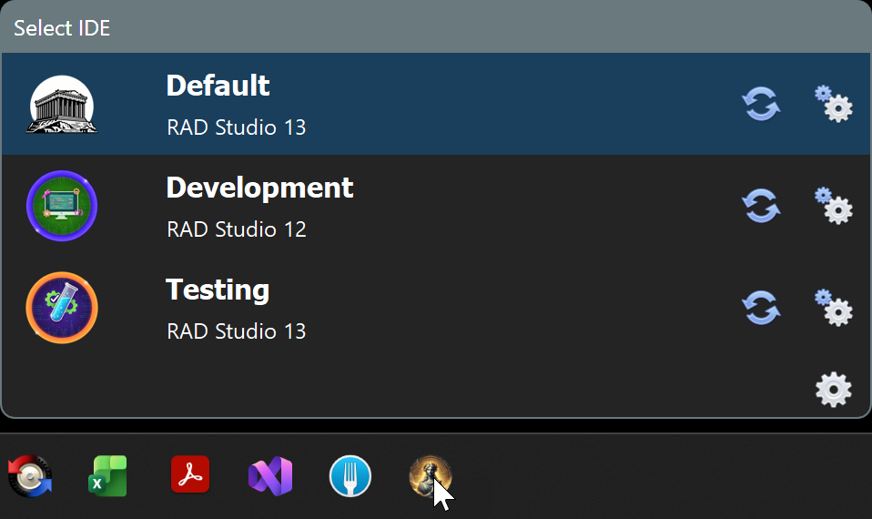
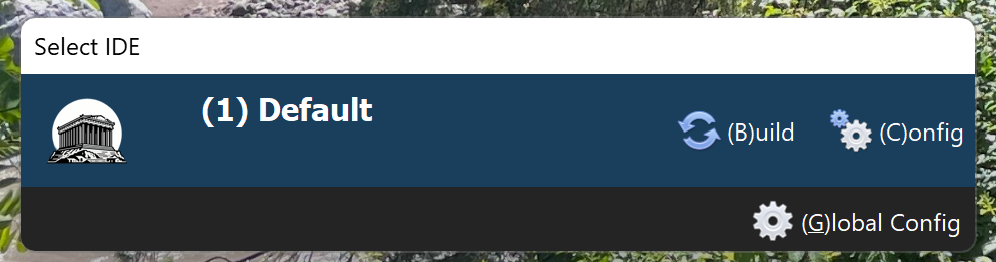
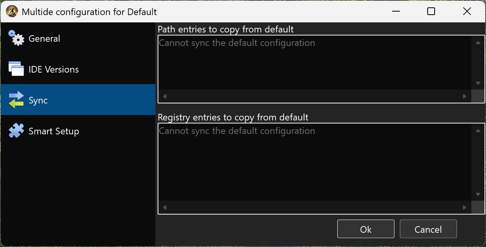
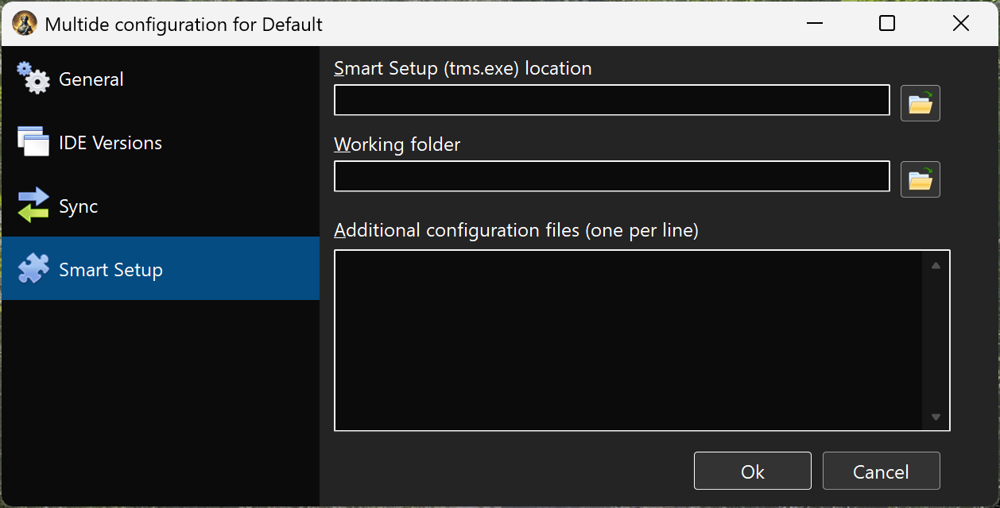

# MultIDE

MultIDE is a Windows application for managing multiple Embarcadero RAD Studio (Delphi) configurations. It allows you to create and launch different IDE instances, each with its own registry settings, component sets, and environment configurations.



## Features

- **Multiple IDE Configurations**: Create separate configurations for different projects or component sets, each running with isolated registry keys
- **No CPU or Memory used if not running**: MultIDE is not a service or background process. You open it, it does its job, and it closes.
- **Dark and Light Mode**: Automatically follows the Windows theme, or manually select your preferred appearance
- **Registry Synchronization**: Copy specific registry entries from the default RAD Studio configuration to your custom configurations
- **SmartSetup Integration**: Use different component sets for each configuration by integrating with TMS SmartSetup
- **PATH Filtering**: Control which PATH entries are passed to each IDE instance, allowing different BPL versions for different configurations

## Installation

MultIDE is designed to be pinned to the Start menu or Taskbar.

1. Download the latest version from https://github.com/agallero/multide/releases/latest/download/multide.zip and extract it to a folder on your hard disk
2. Right-click `multide.exe` and pin it to your Taskbar or Start menu

## Usage

### First Launch

When you first click the MultIDE icon, it opens with a Default configuration:


Click the  icon to the right of any configuration to change its settings, or press **C** to access the settings page.

> [!NOTE]
> Pressing any key changes the interface to show available keyboard shortcuts:
>
> 

### Configuration Settings

#### General


In the General section, you can set the configuration name, choose an identifying image, and specify extra parameters to pass to `bds.exe`.

> [!NOTE]
> The Default configuration cannot be renamed or deleted.

#### IDE Versions


Select the RAD Studio version to use. If no version is selected, launching the configuration will fail with an error.

#### Sync



Define which registry entries from the Default configuration should be copied to this configuration. This is useful for sharing settings like Known Packages, Library Paths, or other IDE preferences.

See [Registry Synchronization](#registry-synchronization) and [PATH Synchronization](#path-synchronization) below.

#### SmartSetup



These settings are optional and only needed if you want to invoke SmartSetup from MultIDE:

1. **SmartSetup Location**: Path to `tms.exe`
2. **SmartSetup Working Folder**: Path to `tms.config.yaml`
3. **Additional configuration files**: Extra `tms.config.yaml` files that override settings in the original. Usually left empty.

Once configured, you can update components by clicking the update button  on the main screen.

> [!NOTE]
> The update button updates all components to their latest versions. Pin any components you don't want updated. You can skip this configuration entirely if you prefer to run SmartSetup manually.

### Creating a New Configuration

1. Press **G** to open Global Configuration
2. Click **Add Configuration** to create a new IDE profile
3. Configure the profile settings:
   - Select the Delphi version
   - Set a custom icon (optional)
   - Configure SmartSetup paths (optional)
   - Set up registry and PATH synchronization rules

### Launching an IDE

- Click a configuration in the main list, or
- Press **1-9** to launch configurations by position

### Keyboard Shortcuts

| Key | Action |
|-----|--------|
| 1-9 | Launch configuration by position |
| B | Build SmartSetup components |
| C | Open configuration settings |
| G | Open global settings |

## Registry Synchronization

Copy specific registry entries from the Default RAD Studio configuration to custom configurations.

### Format

```
# Comments start with #
+Pattern    # Include entries matching pattern
-Pattern    # Exclude entries matching pattern
```

### Examples

```
# Sync all Known Packages except specific ones
+Known Packages\*
-Known Packages\*\dclTMS*

# Sync library paths
+Library\*
```

Patterns support wildcards (`*`) and match against registry paths relative to the RAD Studio version key.

## PATH Synchronization

Control which Windows PATH entries are passed to the launched IDE. This allows different configurations to use different BPL versions.

### Format

Same syntax as Registry Synchronization:

```
# Include Embarcadero paths
+*\Embarcadero\*
+$(SmartSetup)

# Exclude old RAD Studio versions
-*\RAD Studio\9.0\*
```

> [Important]
> You can use the variable $(SmartSetup) to add the path set for SmartSetup to the paths added. But if you do, remember to set the smart setup working folder to a valid value.

## Export/Import Configurations

Use the **Export Configurations** and **Import Configurations** buttons in Global Settings to back up or transfer your MultIDE setup between machines.

## Building MultiDE from Source

To build from source, use the command:
```shell
tms build multide
```
