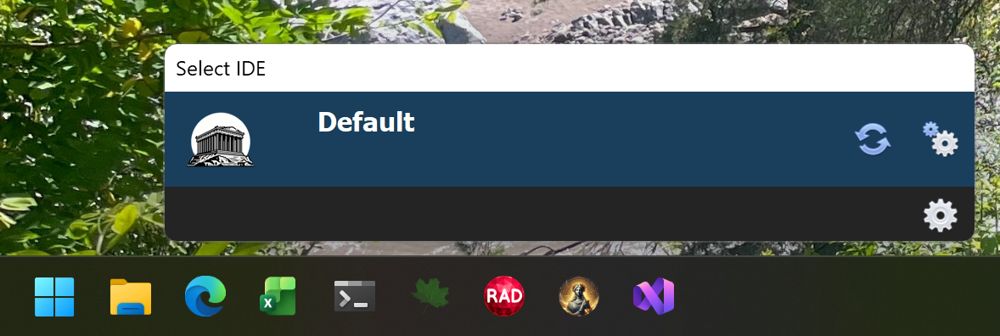
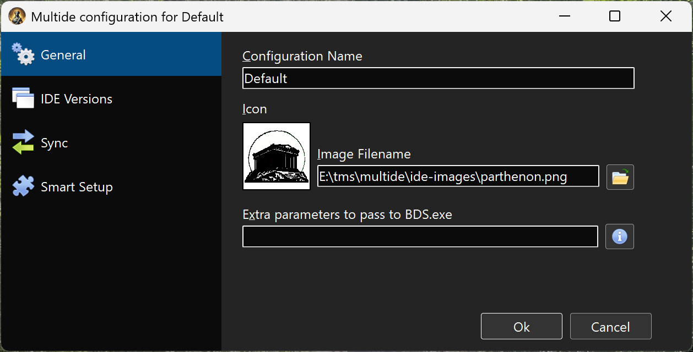
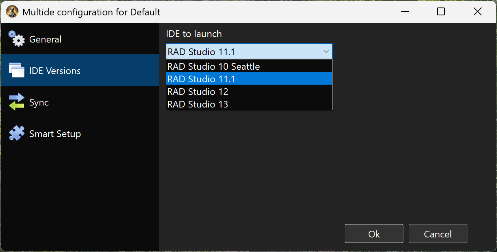

# MultIDE

MultIDE is a Windows application for managing multiple Embarcadero RAD Studio (Delphi) configurations. It allows you to create and launch different IDE instances, each with its own registry settings, component sets, and environment configurations.


## Features

- **Multiple IDE Configurations**: Create separate configurations for different projects or component sets, each running with isolated registry keys
- **No CPU or Memory used if not running**: MultIDE is not a service or a background app. You open it, it does it job, and it closes.
- **Dark and Light Mode**: Automatically follows Windows theme or manually select your preferred appearance
- **Registry Synchronization**: Copy specific registry entries from the default RAD Studio configuration to your custom configurations
- **SmartSetup Integration**: Use different component sets for each configuration by integrating with TMS SmartSetup
- **PATH Filtering**: Control which PATH entries are passed to each IDE instance, so you can have different bpl versions for different configurations.

## Installation

MultIDE is designed to be pinned to either the Start menu or the Taskbar.
1. Grab the latest version from https://github.com/agallero/multide/releases/latest/download/multide.zip and unzip it somewhere in your hard disk.
2. Right-click multide.exe and pin it to your Taskbar or Start menu


## Usage
### First launch

When you first click in the MultIDE icon, it will open a screen with a Default configuration:



You can click in the  icon at the right of the configuration to change its settings. Or you can also press the "C" key to access the settings page.

> [!NOTE]
> If you press any key, the interface will change to show the available keyboard shortcuts:
>
> 

### Changing configuration settings
#### General settings



In the general section of the settings, you can choose the name of the configuration, an image to identify it, and, if needed, some extra parameters to pass to bds.exe.

> [!NOTE]
> You can't rename or delete the default configuration

#### IDE settings


Here you can select the Rad Studio version that you want to use. If none is selected, you will get an error when trying to launch the configuration.

#### Sync settings


In this screen you define what registry entries from the default configuration should be copied to the specific configuration. This is useful for sharing settings like Known Packages, Library Paths, or other IDE preferences.

See Registry Synchronization and Path Synchronization below.

#### SmartSetup Settings


The settings in this screen are optional. You only need to set them if you want to be able to call smartsetup from MultIDE:

1. Set the **SmartSetup Location** to point to where tms.exe is
2. Set the **SmartSetup Working Folder** to point to where tms.config.yaml is.
3. The additional configuration files are extra tms.config.yaml files that will override the settings in the original tms.config.yaml. In most cases, this entry will be empty.
If you configure SmartSetup, then you can automatically update the components by clicking the update button  in the main screen.

> [!NOTE]
> The update button will update all components to their latest versions. If you don't want to update them all, make sure to pin the components you don't want to update. You can also skip configuring this screen even if you use SmartSetup, if you prefer to update manually.

### Creating a new Configuration

1. Open MultIDE and press **G** to open Global Configuration
2. Click **Add Configuration** to create a new IDE profile
3. Configure the profile settings:
   - Select the Delphi version
   - Set a custom icon (optional)
   - Configure SmartSetup paths (optional)
   - Set up registry and PATH synchronization rules

### Launching an IDE

- Click on a configuration in the main list, or
- Use keyboard shortcuts **1-9** to quickly launch configurations by position

### Keyboard Shortcuts

| Key | Action |
|-----|--------|
| 1-9 | Launch configuration by position |
| B | Build SmartSetup components |
| C | Open configuration settings |
| G | Open global settings |


## Registry Synchronization

### Configuration Format

In the Registry Entries to Sync field, use the following syntax:

```
# Comments start with #
+Pattern    # Include entries matching pattern
-Pattern    # Exclude entries matching pattern
```

### Examples

```
# Sync all Known Packages except specific ones
+Known Packages\*
-Known Packages\*\dclTMS*

# Sync library paths
+Library\*
```

Patterns support wildcards (`*`) and are matched against the registry path relative to the RAD Studio version key.

## PATH Synchronization

Control which Windows PATH entries are passed to the launched IDE. This allows different configurations to use different tool versions.

### Configuration Format

Same syntax as Registry Synchronization:

```
# Include Embarcadero paths
+*\Embarcadero\*
+C:\Windows\*

# Exclude old RAD Studio versions
-*\RAD Studio\9.0\*
```


## Export/Import Configurations

Use the **Export Configurations** and **Import Configurations** buttons in Global Settings to backup or transfer your MultIDE setup between machines.
